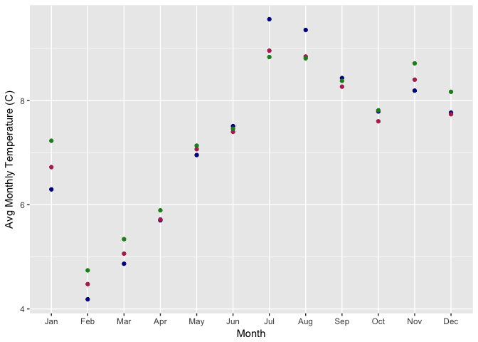
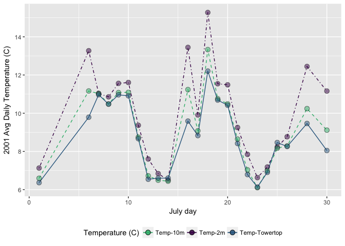
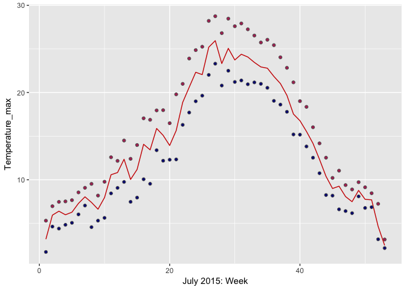
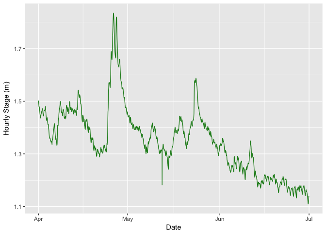
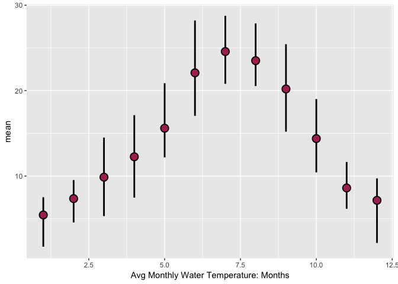

R-timeseries
================
Ryan Peek
Updated: 2017-02-27

-   [Background Reading](#background-reading)
-   [Dates & Times in R](#dates-times-in-r)
    -   [Working with Dates](#working-with-dates)
        -   [The `lubridate` package & Dates](#the-lubridate-package-dates)
    -   [Working with Datetimes & Timezones](#working-with-datetimes-timezones)
        -   [The `lubridate` package & datetimes](#the-lubridate-package-datetimes)
    -   [Datetimes without Timezones (and `chron`)](#datetimes-without-timezones-and-chron)
    -   [Challenge 1: Mauna Loa Meterological Data](#challenge-1-mauna-loa-meterological-data)
        -   [Challenge 1](#challenge-1)
    -   [Challenge 2: Pressure Transducer (Solinst) Data Logger](#challenge-2-pressure-transducer-solinst-data-logger)
        -   [Challenge 2](#challenge-2)

Background Reading
==================

These resources are very useful. Please read through them.

-   This is a great overview of times and dates in R from [Bonnie Dixon's talk at the Davis R-Users Group](http://www.noamross.net/blog/2014/2/10/using-times-and-dates-in-r---presentation-code.html)

-   [A very comprehensive and detailed look at using dates in R](https://www.stat.berkeley.edu/~s133/dates.html)

-   [The vignette on using lubridate](https://cran.r-project.org/web/packages/lubridate/vignettes/lubridate.html)

Dates & Times in R
==================

Importantly, there are **3** basic time classes in R:

-   Dates (just dates, i.e., 2012-02-10)
-   POSIXct ("**ct**" == calendar time, best class for dates with times)
-   POSIXlt ("**lt**" == local time, enables easy extraction of specific components of a time, however, remember that POXIXlt objects are lists)

So, for some brief examples/discussion about each of these classes, please read below. Unfortunately converting dates & times in R into formats that are computer readable can be frustrating, mainly because there is very little consistency. In particular, if you are importing things from Excel, keep in mind dates can get especially weird[1], depending on the operating system you are working on, the format of your data, etc.

Working with Dates
------------------

The `Date` class in R can easily be converted or operated on numerically, depending on the interest. Let's make a string of dates to use for our example:

-   `sample_dates_1 <- c("2016-02-01", "2016-03-21", "2016-10-05", "2017-01-01", "2017-02-18")` *notice we have dates across two years here*

So to translate these into the `Date` class in R, we need to do a few things...first notice our sample dates are in a very nice order (YYYY-MM-DD). This works well with the function `as.Date`:

-   `as.Date(sample_dates_1)`

What happens with different orders...say MM-DD-YYYY?

``` r
# Some sample dates: 
sample_dates_2 <- c("02-01-2016", "03-21-2016", "10-05-2016", "01-01-2017", "02-18-2017")

as.Date(sample_dates_2) # well that doesn't work
```

    ## [1] "0002-01-20" NA           "0010-05-20" "0001-01-20" NA

Well, the reason is the computer expects one thing, but is getting something else. Remember, **write code you can read and your computer can understand**. So we need to give some more information here so this will interpret correctly.

``` r
# Some sample dates: 
sample_dates_2 <- c("02-01-2016", "03-21-2016", "10-05-2016", "01-01-2017", "02-18-2017")

as.Date(sample_dates_2, format = "%m-%d-%Y" ) # date code preceded by "%"
```

    ## [1] "2016-02-01" "2016-03-21" "2016-10-05" "2017-01-01" "2017-02-18"

To see a list of the date-time format codes in R, check out this [page and table](https://www.stat.berkeley.edu/~s133/dates.html).

The nice thing is this method works well with pretty much any format, you just need to provide the associated codes and structure:

-   `as.Date("2016/01/01", format="%Y/%m/%d")`=2016-01-01
-   `as.Date("05A21A2011", format="%mA%dA%Y")`=2011-05-21
-   `as.Date("Feb 13, 2011", format="%b %d, %Y")`=2011-05-21

### The `lubridate` package & Dates

The `lubridate` package will handle 90% of the date & datetime issues you need to deal with. It is fast, much easier to work with, and I recommend using it wherever possible. Do keep in mind sometimes you need to fall back on the base R functions (i.e., `as.Date()`).

Same idea here, just simpler to type, read, write.

-   `lubridate::ymd("2016/01/01")`=2016-01-01
-   `lubridate::ymd("2011-03-19")`=2011-03-19
-   `lubridate::mdy("Feb 19, 2011")`=2011-02-19
-   `lubridate::dmy("22051997")`=1997-05-22

Working with Datetimes & Timezones
----------------------------------

Similar to `as.Date` there are two functions for each datetime class in R. `as.POSIXct` and `as.POSIXlt`. The arguments are the largely the same, but two important components to consider are a `strptime` function to help format the datetime (similar to `as.Date`), and a timezone argument `tz`, for adding the appropriate timezone.

Keep in mind the default datetime format is `YMD HM` or `YMD HMS`, so if you use that format you won't need to use the `strptime` option.

**as.POSIXct**

-   Example 1 (default doesn't need `strptime`): `as.POSIXct("2016-01-01 12:00", "America/Los_Angeles")` = 2016-01-01 12:00:00
-   Example 2 (24 hr time): `as.POSIXct(strptime("2016/04/05 14:47",format = "%Y/%m/%d %H:%M"), "America/Los_Angeles")` = 2016-04-05 14:47:00
-   Example 3 (12 hr time): `as.POSIXct(strptime("2016/04/05 4:47 PM",format = "%Y/%m/%d %H:%M PM"), "America/Los_Angeles")` = 2016-04-05 04:47:00

### The `lubridate` package & datetimes

Same as before, now just add `_hms` or `_hm` to `ymd`. `lubridate` will default to the POSIXct format.

-   Example 1: `lubridate::ymd_hm("2016-01-01 12:00", tz="America/Los_Angeles")` = 2016-01-01 12:00:00
-   Example 2 (24 hr time): `lubridate::ymd_hm("2016/04/05 14:47", tz="America/Los_Angeles")` = 2016-04-05 14:47:00
-   Example 3 (12 hr time but converts to 24): `lubridate::ymd_hms("2016/04/05 4:47:21 PM", tz="America/Los_Angeles")` = 2016-04-05 16:47:21

Datetimes without Timezones (and `chron`)
-----------------------------------------

The `chron` package may be helpful for these tasks, however, this may also be a suitable use of the POSIXlt class.

-   `chron::as.chron("2013-07-24 23:55:26")` = 1.591099710^{4}
-   `chron::as.chron("07/25/13 08:32:07", "%m/%d/%y %H:%M:%S")` = 1.591135610^{4}

Challenge 1: Mauna Loa Meterological Data
-----------------------------------------

So, now that we have a decent idea how to format these things, let's look at some real data, try to format and plot. Let's use the Mauna Loa meterological data, collected every minute for the year 2001. *This dataset has 459,769 observations for 9 different metrics of wind, humidity, barometric pressure, air temperature, and precipitation.*

``` r
# let's load our climate data from our previous lesson:

load("data_output/mauna_loa_met_2001_minute.rda")

library(lubridate, warn.conflicts = F)
library(dplyr, warn.conflicts = F)

summary(mloa_2001)
```

    ##    filename         siteID            year          month       
    ##  Length:459769      MLO:459769   Min.   :2001   Min.   : 1.000  
    ##  Class :character                1st Qu.:2001   1st Qu.: 3.000  
    ##  Mode  :character                Median :2001   Median : 6.000  
    ##                                  Mean   :2001   Mean   : 6.474  
    ##                                  3rd Qu.:2001   3rd Qu.:10.000  
    ##                                  Max.   :2001   Max.   :12.000  
    ##       day            hour24           min           windDir      
    ##  Min.   : 1.00   Min.   : 0.00   Min.   : 0.00   Min.   :-999.0  
    ##  1st Qu.: 8.00   1st Qu.: 5.00   1st Qu.:15.00   1st Qu.: 115.0  
    ##  Median :15.00   Median :11.00   Median :30.00   Median : 156.0  
    ##  Mean   :15.44   Mean   :11.43   Mean   :29.51   Mean   : 144.5  
    ##  3rd Qu.:22.00   3rd Qu.:18.00   3rd Qu.:45.00   3rd Qu.: 236.0  
    ##  Max.   :31.00   Max.   :23.00   Max.   :59.00   Max.   : 360.0  
    ##  windSpeed_m_s       windSteady    baro_hPa        temp_C_2m       
    ##  Min.   :-99.900   Min.   :-9   Min.   :-999.9   Min.   :-999.900  
    ##  1st Qu.:  1.900   1st Qu.:-9   1st Qu.:-999.9   1st Qu.:   4.400  
    ##  Median :  3.500   Median :-9   Median :-999.9   Median :   6.900  
    ##  Mean   :  1.229   Mean   :-9   Mean   :-999.9   Mean   :   4.747  
    ##  3rd Qu.:  5.900   3rd Qu.:-9   3rd Qu.:-999.9   3rd Qu.:   9.400  
    ##  Max.   : 20.500   Max.   :-9   Max.   :-999.9   Max.   :  18.900  
    ##    temp_C_10m      temp_C_towertop      rel_humid      precip_intens_mm_hr
    ##  Min.   :-999.90   Min.   :-999.900   Min.   :-99.00   Min.   :-99.0000   
    ##  1st Qu.:   4.90   1st Qu.:   5.600   1st Qu.: 14.00   1st Qu.:  0.0000   
    ##  Median :   6.90   Median :   7.200   Median : 28.00   Median :  0.0000   
    ##  Mean   : -46.69   Mean   :   1.539   Mean   : 31.82   Mean   : -0.8066   
    ##  3rd Qu.:   8.60   3rd Qu.:   8.800   3rd Qu.: 57.00   3rd Qu.:  0.0000   
    ##  Max.   :  16.90   Max.   :  16.200   Max.   :138.00   Max.   : 60.0000

``` r
names(mloa_2001)
```

    ##  [1] "filename"            "siteID"              "year"               
    ##  [4] "month"               "day"                 "hour24"             
    ##  [7] "min"                 "windDir"             "windSpeed_m_s"      
    ## [10] "windSteady"          "baro_hPa"            "temp_C_2m"          
    ## [13] "temp_C_10m"          "temp_C_towertop"     "rel_humid"          
    ## [16] "precip_intens_mm_hr"

One of the important components to consider is each of the datetime columns has been separated...so how do we get them into one column so we can format it as a datetime? The answer is the `paste` function.

-   `paste()` allows pasting text or vectors (& columns) by a given separator that you specify
-   `paste0()` is the same thing, but defaults to using a **`,`** as the separator.

``` r
# we need to make a datetime column...let's use paste
mloa_2001$datetime <- paste0(mloa_2001$year,"-", mloa_2001$month, "-", mloa_2001$day," ", mloa_2001$hour24, ":", mloa_2001$min) # this makes a character column

head(mloa_2001$datetime) # character vector but not POSIXct yet
```

    ## [1] "2001-1-1 0:0" "2001-1-1 0:1" "2001-1-1 0:2" "2001-1-1 0:3"
    ## [5] "2001-1-1 0:4" "2001-1-1 0:5"

``` r
# we can nest this within a lubridate function to convert directly to POSIXct
mloa_2001$datetime <- ymd_hm(paste0(mloa_2001$year,"-", mloa_2001$month, "-", mloa_2001$day," ", mloa_2001$hour24, ":", mloa_2001$min), tz = "Pacific/Honolulu")

summary(mloa_2001) # notice a new column called "datetime"
```

    ##    filename         siteID            year          month       
    ##  Length:459769      MLO:459769   Min.   :2001   Min.   : 1.000  
    ##  Class :character                1st Qu.:2001   1st Qu.: 3.000  
    ##  Mode  :character                Median :2001   Median : 6.000  
    ##                                  Mean   :2001   Mean   : 6.474  
    ##                                  3rd Qu.:2001   3rd Qu.:10.000  
    ##                                  Max.   :2001   Max.   :12.000  
    ##       day            hour24           min           windDir      
    ##  Min.   : 1.00   Min.   : 0.00   Min.   : 0.00   Min.   :-999.0  
    ##  1st Qu.: 8.00   1st Qu.: 5.00   1st Qu.:15.00   1st Qu.: 115.0  
    ##  Median :15.00   Median :11.00   Median :30.00   Median : 156.0  
    ##  Mean   :15.44   Mean   :11.43   Mean   :29.51   Mean   : 144.5  
    ##  3rd Qu.:22.00   3rd Qu.:18.00   3rd Qu.:45.00   3rd Qu.: 236.0  
    ##  Max.   :31.00   Max.   :23.00   Max.   :59.00   Max.   : 360.0  
    ##  windSpeed_m_s       windSteady    baro_hPa        temp_C_2m       
    ##  Min.   :-99.900   Min.   :-9   Min.   :-999.9   Min.   :-999.900  
    ##  1st Qu.:  1.900   1st Qu.:-9   1st Qu.:-999.9   1st Qu.:   4.400  
    ##  Median :  3.500   Median :-9   Median :-999.9   Median :   6.900  
    ##  Mean   :  1.229   Mean   :-9   Mean   :-999.9   Mean   :   4.747  
    ##  3rd Qu.:  5.900   3rd Qu.:-9   3rd Qu.:-999.9   3rd Qu.:   9.400  
    ##  Max.   : 20.500   Max.   :-9   Max.   :-999.9   Max.   :  18.900  
    ##    temp_C_10m      temp_C_towertop      rel_humid      precip_intens_mm_hr
    ##  Min.   :-999.90   Min.   :-999.900   Min.   :-99.00   Min.   :-99.0000   
    ##  1st Qu.:   4.90   1st Qu.:   5.600   1st Qu.: 14.00   1st Qu.:  0.0000   
    ##  Median :   6.90   Median :   7.200   Median : 28.00   Median :  0.0000   
    ##  Mean   : -46.69   Mean   :   1.539   Mean   : 31.82   Mean   : -0.8066   
    ##  3rd Qu.:   8.60   3rd Qu.:   8.800   3rd Qu.: 57.00   3rd Qu.:  0.0000   
    ##  Max.   :  16.90   Max.   :  16.200   Max.   :138.00   Max.   : 60.0000   
    ##     datetime                  
    ##  Min.   :2001-01-01 00:00:00  
    ##  1st Qu.:2001-03-29 06:57:00  
    ##  Median :2001-06-24 06:13:00  
    ##  Mean   :2001-06-30 15:28:42  
    ##  3rd Qu.:2001-10-07 00:34:00  
    ##  Max.   :2001-12-31 23:59:00

``` r
head(mloa_2001$datetime) # in POSIXct
```

    ## [1] "2001-01-01 00:00:00 HST" "2001-01-01 00:01:00 HST"
    ## [3] "2001-01-01 00:02:00 HST" "2001-01-01 00:03:00 HST"
    ## [5] "2001-01-01 00:04:00 HST" "2001-01-01 00:05:00 HST"

### Challenge 1

-   Remove the NA's (-99 and -999) in `rel_humid`, `temp_C_2m`, `windSpeed_m_s`
-   Use `dplyr` to calculate the mean monthly temperature (`temp_C_2m`) using the `datetime` column (*HINT: look at `lubridate` functions like `month()`*)
-   Make a ggplot of the avg monthly temperature
-   Make a ggplot of the daily average temperature for July (*HINT: try `yday()` function with some `summarize()` in `dplyr`*)

**Solutions**

| mon |  avg\_temp\_2m|  avg\_temp\_10m|  avg\_temp\_tower|
|:----|--------------:|---------------:|-----------------:|
| Jan |           6.29|            6.72|              7.23|
| Feb |           4.18|            4.48|              4.74|
| Mar |           4.87|            5.06|              5.34|
| Apr |           5.70|            5.72|              5.89|
| May |           6.95|            7.07|              7.13|
| Jun |           7.51|            7.40|              7.46|
| Jul |           9.56|            8.96|              8.84|
| Aug |           9.36|            8.85|              8.81|
| Sep |           8.43|            8.27|              8.38|
| Oct |           7.79|            7.60|              7.81|
| Nov |           8.19|            8.40|              8.71|
| Dec |           7.77|            7.74|              8.17|



Challenge 2: Pressure Transducer (Solinst) Data Logger
------------------------------------------------------

Let's practice with another data file, a logger that records water temperature and river stage every 15 minutes from the NF American River. You can download the file by right clicking on the [webpage](https://raw.githubusercontent.com/gge-ucd/wRangling_Seminar/master/data/2015_NFA_solinst_08_05.csv), or simply use the web URL. We've practiced both now.

*This dataset has 35,038 observations for water temperature, and stage (pressure transducer info).*

> First part of the challenge: Read in and assign the data to your environment using either the direct webpage URL, or the downloaded file.

    ##          Date             Time             ms        Level       
    ##  2014/08/06:   96   00:00:00:  365   Min.   :0   Min.   :0.7718  
    ##  2014/08/07:   96   00:15:00:  365   1st Qu.:0   1st Qu.:1.1190  
    ##  2014/08/08:   96   00:30:00:  365   Median :0   Median :1.3135  
    ##  2014/08/09:   96   00:45:00:  365   Mean   :0   Mean   :1.3791  
    ##  2014/08/10:   96   01:00:00:  365   3rd Qu.:0   3rd Qu.:1.5235  
    ##  2014/08/11:   96   01:15:00:  365   Max.   :0   Max.   :4.7376  
    ##  (Other)   :34462   (Other) :32848                               
    ##   Temperature    
    ##  Min.   : 1.724  
    ##  1st Qu.: 8.197  
    ##  Median :13.258  
    ##  Mean   :14.291  
    ##  3rd Qu.:20.960  
    ##  Max.   :28.748  
    ## 

    ## [1] "Date"        "Time"        "ms"          "Level"       "Temperature"

### Challenge 2

-   Make a `datetime` column and format as `POSIXct`
-   Calculate Weekly **Mean, Max, Min** Water Temperatures and plot as point or line plot *(HINT: `dplyr` function)*
-   Calculate Hourly mean **Level** for April through June and make a line plot (using `ggplot2`).
-   Make a ggplot geom\_pointrange plot of the avg. max, min monthly temperatures.

**Solutions**

    ##         Date     Time ms  Level Temperature            datetime   yr mon
    ## 1 2014/08/05 11:00:00  0 0.8245      23.069 2014-08-05 11:00:00 2014   8
    ## 2 2014/08/05 11:15:00  0 1.1457      22.023 2014-08-05 11:15:00 2014   8
    ## 3 2014/08/05 11:30:00  0 1.1485      22.030 2014-08-05 11:30:00 2014   8
    ## 4 2014/08/05 11:45:00  0 1.1482      22.035 2014-08-05 11:45:00 2014   8
    ## 5 2014/08/05 12:00:00  0 1.1504      22.033 2014-08-05 12:00:00 2014   8
    ## 6 2014/08/05 12:15:00  0 1.1495      22.028 2014-08-05 12:15:00 2014   8
    ##   wk DOY hr
    ## 1 31 217 11
    ## 2 31 217 11
    ## 3 31 217 11
    ## 4 31 217 11
    ## 5 31 217 12
    ## 6 31 217 12



[1] For example Excel stores dates as a number representing days since 1900-Jan-0, plus a fractional portion of a 24 hour day (**serial-time**), but in OSX (Mac), it is 1904-Jan-0.
